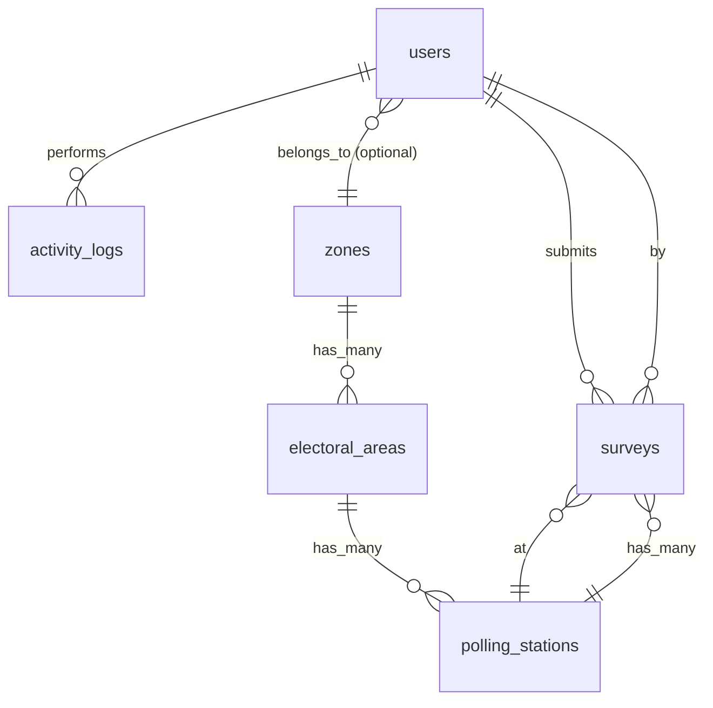

# COMPLETE LARAVEL CAMPAIGN TRACKING SYSTEM DOCUMENTATION

## PROJECT: New Juaben Constituency Campaign Tracking System

---

## 1. PROJECT OVERVIEW

### 1.1 System Purpose
A comprehensive web-based platform to manage political campaign operations across 34 electoral areas and 198 polling stations in the New Juaben Constituency. The system enables real-time voter sentiment tracking, team management, and data-driven campaign decision-making.

### 1.2 Key Objectives
- Digital transformation of grassroots campaign management
- Real-time voter sentiment tracking and analysis
- Hierarchical team management and accountability
- Data-driven resource allocation and strategy
- Comprehensive reporting and analytics

### 1.3 Target Users
- Constituency Executives (17 members)
- Zonal Coordinators (6 coordinators)
- Electoral Area Coordinators (34 coordinators)
- Polling Station Agents (198 agents)

---

## 2. SYSTEM ARCHITECTURE

### 2.1 Technology Stack
- Backend Framework: Laravel 10.x
- Frontend: Blade Templates + Bootstrap 5 + JavaScript
- Database: MySQL 8.0
- Authentication: Laravel Breeze
- Export Functionality: Maatwebsite/Laravel-Excel
- Development Server: Laravel Sail / XAMPP

### 2.2 System Requirements
- PHP 8.1 or higher
- Composer 2.0 or higher
- MySQL 8.0 or higher
- Node.js 16.0 or higher
- 2GB RAM minimum
- 500MB disk space

### 2.3 Deployment Architecture
```
User Browser → Laravel Application (Apache/Nginx) → MySQL Database
                         ↓
                  File Storage (exports, backups)
```

---

## 3. DATABASE DESIGN

### 3.1 Database Schema Overview

Core Tables:
1. users — System users with roles and permissions
2. zones — 6 constituency-wide zones
3. electoral_areas — 34 electoral areas assigned to zones
4. polling_stations — 198 polling stations with agent information
5. surveys — Voter sentiment data collection
6. activity_logs — System usage tracking

### 3.2 Table Relationships (ERD)



### 3.3 Data Models Specification

#### User
Purpose: Manage system users and authentication

Fields:
- id, name, username, email, password, phone, role, zone_id, status, timestamps

Relationships:
- BelongsTo Zone (for zonal coordinators)
- HasMany Surveys
- HasMany ActivityLogs

#### Zone
Purpose: Manage 6 constituency-wide zones

Fields:
- id, zone_name, zone_code, timestamps

Relationships:
- HasMany ElectoralAreas
- HasOne User (as zonal coordinator)
- HasManyThrough PollingStations
- HasManyThrough Surveys

#### ElectoralArea
Purpose: Manage 34 electoral areas

Fields:
- id, area_name, area_code, zone_id, timestamps

Relationships:
- BelongsTo Zone
- HasMany PollingStations

#### PollingStation
Purpose: Manage 198 polling stations

Fields:
- id, station_code, station_name, electoral_area_id, location, agent_name, agent_phone, voter_population, timestamps

Relationships:
- BelongsTo ElectoralArea
- HasMany Surveys

#### Survey
Purpose: Track voter sentiment and campaign data

Fields:
- id, user_id, polling_station_id, support_level, supporters_count, key_issues, specific_concerns, follow_up_required, follow_up_action, survey_notes, survey_date, timestamps

Relationships:
- BelongsTo User
- BelongsTo PollingStation

#### ActivityLog
Purpose: Track user activities for audit

Fields:
- id, user_id, action, ip_address, user_agent, payload (JSON), created_at

Relationships:
- BelongsTo User

---

## 4. USER ROLES AND PERMISSIONS

### 4.1 System Administrator
Responsibilities:
- Overall system management
- User account management
- Zone and area configuration
- System monitoring and reporting

Permissions:
- Full access to all system features
- User creation, modification, and deletion
- Data import/export capabilities
- System configuration access

### 4.2 Zonal Coordinator
Responsibilities:
- Manage assigned zone (1 of 6 zones)
- Monitor 5-6 electoral areas
- Supervise 30-40 polling stations
- Conduct and review voter sentiment surveys

Permissions:
- Access only to assigned zone data
- Create and view surveys for their zone
- View reports for their zone
- Update their profile information

Restrictions:
- Cannot access other zones' data
- Cannot modify user accounts
- Cannot change system configuration

### 4.3 Electoral Area Coordinator
Responsibilities:
- Manage assigned electoral area
- Oversee polling stations
- Support survey activities and data quality

Permissions:
- Access only to their electoral area
- Create/view surveys for their area

### 4.4 Polling Station Agent
Responsibilities:
- Collect voter sentiment data
- Report polling station incidents and concerns

Permissions:
- Create surveys for assigned station
- View their own submissions

---

## 5. CORE FEATURES

### 5.1 Authentication System
- User registration and login
- Role-based access control
- Password reset functionality
- Session management
- Secure logout

### 5.2 Dashboard System
Admin Dashboard:
- System overview statistics
- User management interface
- Zone configuration
- Comprehensive reporting

Zonal Coordinator Dashboard:
- Zone-specific overview
- Electoral areas list with progress
- Polling stations coverage
- Recent survey activity
- Quick action buttons

### 5.3 Survey Management
Survey Creation:
- Electoral area selection (filtered by zone)
- Polling station selection (dynamic filtering)
- Support level classification (KEN/BAWUMIA/DR ADU TWU/REMARKS)
- Voter concerns and issues tracking
- Follow-up requirement flagging

Survey Tracking:
- Historical survey data
- Progress monitoring
- Completion statistics
- Trend analysis

### 5.4 Geographical Management
Zone Management:
- Create and manage 6 zones
- Assign electoral areas to zones
- Assign coordinators to zones

Electoral Area Management:
- Manage 34 electoral areas
- Assign to appropriate zones
- Track polling station counts

Polling Station Management:
- Manage 198 polling stations
- Assign to electoral areas
- Track agent information
- Monitor voter population

### 5.5 Reporting System
Real-time Analytics:
- Support level percentages
- Zone comparison reports
- Survey completion rates
- Voter concern analysis

Data Export:
- Excel export functionality
- PDF report generation
- Custom report formats
- Filtered data exports

Visualization:
- Support level charts
- Progress tracking graphics
- Geographical heat maps
- Trend analysis graphs

---

## 6. USER INTERFACE DESIGN

### 6.1 Layout Structure
Main Layout Components:
- Navigation header with user info
- Sidebar navigation menu
- Main content area
- Footer with system information

Responsive Design:
- Mobile-friendly interfaces
- Tablet-optimized layouts
- Desktop-enhanced features

### 6.2 Page Templates
Login Page:
- Clean, professional design
- System branding
- Login form with validation
- Password recovery options

Admin Dashboard:
- System statistics cards
- Quick access buttons
- Recent activity feed
- User management shortcuts

Zonal Coordinator Dashboard:
- Zone welcome message
- Electoral areas progress
- Survey completion metrics
- Quick survey action button

Survey Form:
- Step-by-step form layout
- Dynamic dropdown filtering
- Support level radio buttons
- Text areas for detailed notes
- Validation and error handling

Management Interfaces:
- Data tables with pagination
- Search and filter functionality
- Bulk action capabilities
- Import/export buttons

---

## 7. WORKFLOWS

### 7.1 User Registration Workflow
```
1. Admin creates user account
2. System sends welcome email (optional)
3. User receives login credentials
4. User logs in and sets password
5. System assigns appropriate permissions
6. User accesses role-specific dashboard
```

### 7.2 Survey Submission Workflow
```
1. Zonal Coordinator logs in
2. Accesses dashboard
3. Clicks "New Survey"
4. Selects Electoral Area (auto-filtered by zone)
5. Selects Polling Station (auto-filtered by area)
6. Records support level and details
7. Submits survey
8. System updates statistics and logs activity
```

### 7.3 Reporting Workflow
```
1. User accesses reports section
2. Applies filters (date range, zone, area, etc.)
3. Generates report
4. Views on-screen analytics
5. Exports data if needed
6. Shares or archives report
```

---

## 8. DATA SECURITY

### 8.1 Authentication Security
- Password hashing with bcrypt
- CSRF protection
- XSS prevention
- Session timeout management
- Secure cookie handling

### 8.2 Authorization Controls
- Role-based access control
- Data segregation by zone
- Input validation and sanitization
- SQL injection prevention
- File upload security

### 8.3 Data Protection
- Regular automated backups
- Activity logging and audit trails
- Secure data transmission (HTTPS)
- Privacy-compliant data handling

---

## 9. IMPLEMENTATION PHASES

Phase 1: Foundation Setup
- Laravel installation and configuration
- Basic authentication system
- Database design and migration
- Core user management

Phase 2: Geographical Data
- Zones, electoral areas, polling stations setup
- Data import and validation
- Basic management interfaces
- Relationship establishment

Phase 3: Survey System
- Survey data model creation
- Form interfaces development
- Data validation and processing
- Basic reporting functionality

Phase 4: Dashboard Development
- Admin dashboard creation
- Zonal coordinator dashboard
- Statistics and metrics calculation
- Visualization components

Phase 5: Reporting System
- Advanced analytics development
- Export functionality
- Data visualization
- Custom report generation

Phase 6: Polish & Deployment
- Mobile responsiveness
- Performance optimization
- Security enhancements
- Production deployment

---

## 10. SUCCESS METRICS

Technical Metrics:
- System uptime > 99%
- Page load time < 3 seconds
- Concurrent user support > 50
- Data export generation < 30 seconds

User Adoption Metrics:
- User registration rate > 90%
- Daily active users > 80%
- Survey submission rate > 85%
- Feature utilization rate > 75%

Business Metrics:
- Data accuracy improvement > 60%
- Reporting time reduction > 70%
- Resource allocation efficiency > 40%
- Campaign decision speed improvement > 50%

---

## 11. MAINTENANCE AND SUPPORT

Regular Maintenance:
- Daily automated backups
- Weekly system health checks
- Monthly security updates
- Quarterly performance reviews

User Support:
- Comprehensive user documentation
- Training materials and videos
- Help desk support system
- Regular user feedback collection

System Monitoring:
- Uptime monitoring
- Error tracking and reporting
- Performance metrics collection
- Security incident monitoring

---

## 12. DATA DICTIONARY (DETAILED)

Below is a concise data dictionary covering table columns, types, constraints, and indexes.

### 12.1 `users`
- id: BIGINT UNSIGNED, PK, auto-increment
- name: VARCHAR(100), NOT NULL
- username: VARCHAR(50), UNIQUE, NOT NULL
- email: VARCHAR(150), UNIQUE, NOT NULL
- phone: VARCHAR(20), NULL
- role: ENUM('ADMIN','ZONAL_COORDINATOR','AREA_COORDINATOR','POLLING_AGENT'), NOT NULL
- zone_id: BIGINT UNSIGNED, NULL, FK → zones.id (nullable for non-zonal users)
- password: VARCHAR(255), NOT NULL
- status: ENUM('active','inactive') DEFAULT 'active'
- remember_token: VARCHAR(100), NULL
- timestamps
Indexes:
- UNIQUE(username), UNIQUE(email)
- INDEX(zone_id)

### 12.2 `zones`
- id: BIGINT UNSIGNED, PK, auto-increment
- zone_name: VARCHAR(100), NOT NULL
- zone_code: VARCHAR(10), UNIQUE, NOT NULL
- timestamps
Indexes:
- UNIQUE(zone_code)

### 12.3 `electoral_areas`
- id: BIGINT UNSIGNED, PK, auto-increment
- zone_id: BIGINT UNSIGNED, NOT NULL, FK → zones.id (ON DELETE CASCADE)
- area_name: VARCHAR(100), NOT NULL
- area_code: VARCHAR(10), UNIQUE, NOT NULL
- timestamps
Indexes:
- INDEX(zone_id), UNIQUE(area_code)

### 12.4 `polling_stations`
- id: BIGINT UNSIGNED, PK, auto-increment
- electoral_area_id: BIGINT UNSIGNED, NOT NULL, FK → electoral_areas.id (ON DELETE CASCADE)
- station_code: VARCHAR(15), UNIQUE, NOT NULL
- station_name: VARCHAR(150), NOT NULL
- location: VARCHAR(150), NULL
- agent_name: VARCHAR(120), NULL
- agent_phone: VARCHAR(20), NULL
- voter_population: INT UNSIGNED DEFAULT 0
- timestamps
Indexes:
- INDEX(electoral_area_id), UNIQUE(station_code)

### 12.5 `surveys`
- id: BIGINT UNSIGNED, PK, auto-increment
- user_id: BIGINT UNSIGNED, NOT NULL, FK → users.id (ON DELETE RESTRICT)
- polling_station_id: BIGINT UNSIGNED, NOT NULL, FK → polling_stations.id (ON DELETE RESTRICT)
- support_level: ENUM('KEN','BAWUMIA','DR_ADU_TWU','UNDECIDED','OTHER') NOT NULL
- supporters_count: INT UNSIGNED DEFAULT 0
- key_issues: TEXT, NULL
- specific_concerns: TEXT, NULL
- follow_up_required: BOOLEAN DEFAULT FALSE
- follow_up_action: VARCHAR(255), NULL
- survey_notes: TEXT, NULL
- survey_date: DATE NOT NULL
- timestamps
Indexes:
- INDEX(user_id), INDEX(polling_station_id), INDEX(survey_date)

### 12.6 `activity_logs`
- id: BIGINT UNSIGNED, PK, auto-increment
- user_id: BIGINT UNSIGNED, NOT NULL, FK → users.id (ON DELETE CASCADE)
- action: VARCHAR(100), NOT NULL
- ip_address: VARCHAR(45), NULL
- user_agent: VARCHAR(255), NULL
- payload: JSON, NULL
- created_at: TIMESTAMP, NOT NULL
Indexes:
- INDEX(user_id), INDEX(created_at)

---

## 13. LARAVEL MIGRATIONS (EXAMPLES)

Create the core tables using the following migration examples.

```php
<?php // database/migrations/2025_01_01_000000_create_zones_table.php
use Illuminate\Database\Migrations\Migration;
use Illuminate\Database\Schema\Blueprint;
use Illuminate\Support\Facades\Schema;

return new class extends Migration {
    public function up(): void {
        Schema::create('zones', function (Blueprint $table) {
            $table->id();
            $table->string('zone_name', 100);
            $table->string('zone_code', 10)->unique();
            $table->timestamps();
        });
    }
    public function down(): void { Schema::dropIfExists('zones'); }
};
```

```php
<?php // database/migrations/2025_01_01_000010_create_electoral_areas_table.php
use Illuminate\Database\Migrations\Migration;
use Illuminate\Database\Schema\Blueprint;
use Illuminate\Support\Facades\Schema;

return new class extends Migration {
    public function up(): void {
        Schema::create('electoral_areas', function (Blueprint $table) {
            $table->id();
            $table->foreignId('zone_id')->constrained('zones')->cascadeOnDelete();
            $table->string('area_name', 100);
            $table->string('area_code', 10)->unique();
            $table->timestamps();
        });
    }
    public function down(): void { Schema::dropIfExists('electoral_areas'); }
};
```

```php
<?php // database/migrations/2025_01_01_000020_create_polling_stations_table.php
use Illuminate\Database\Migrations\Migration;
use Illuminate\Database\Schema\Blueprint;
use Illuminate\Support\Facades\Schema;

return new class extends Migration {
    public function up(): void {
        Schema::create('polling_stations', function (Blueprint $table) {
            $table->id();
            $table->foreignId('electoral_area_id')->constrained('electoral_areas')->cascadeOnDelete();
            $table->string('station_code', 15)->unique();
            $table->string('station_name', 150);
            $table->string('location', 150)->nullable();
            $table->string('agent_name', 120)->nullable();
            $table->string('agent_phone', 20)->nullable();
            $table->unsignedInteger('voter_population')->default(0);
            $table->timestamps();
        });
    }
    public function down(): void { Schema::dropIfExists('polling_stations'); }
};
```

```php
<?php // database/migrations/2025_01_01_000030_update_users_table_for_roles_and_zone.php
use Illuminate\Database\Migrations\Migration;
use Illuminate\Database\Schema\Blueprint;
use Illuminate\Support\Facades\Schema;

return new class extends Migration {
    public function up(): void {
        Schema::table('users', function (Blueprint $table) {
            $table->string('username', 50)->unique();
            $table->string('phone', 20)->nullable();
            $table->enum('role', ['ADMIN','ZONAL_COORDINATOR','AREA_COORDINATOR','POLLING_AGENT'])->default('POLLING_AGENT');
            $table->foreignId('zone_id')->nullable()->constrained('zones')->nullOnDelete();
            $table->enum('status', ['active','inactive'])->default('active');
        });
    }
    public function down(): void {
        Schema::table('users', function (Blueprint $table) {
            $table->dropConstrainedForeignId('zone_id');
            $table->dropColumn(['username','phone','role','status']);
        });
    }
};
```

```php
<?php // database/migrations/2025_01_01_000040_create_surveys_table.php
use Illuminate\Database\Migrations\Migration;
use Illuminate\Database\Schema\Blueprint;
use Illuminate\Support\Facades\Schema;

return new class extends Migration {
    public function up(): void {
        Schema::create('surveys', function (Blueprint $table) {
            $table->id();
            $table->foreignId('user_id')->constrained('users');
            $table->foreignId('polling_station_id')->constrained('polling_stations');
            $table->enum('support_level', ['KEN','BAWUMIA','DR_ADU_TWU','UNDECIDED','OTHER']);
            $table->unsignedInteger('supporters_count')->default(0);
            $table->text('key_issues')->nullable();
            $table->text('specific_concerns')->nullable();
            $table->boolean('follow_up_required')->default(false);
            $table->string('follow_up_action')->nullable();
            $table->text('survey_notes')->nullable();
            $table->date('survey_date');
            $table->timestamps();
        });
    }
    public function down(): void { Schema::dropIfExists('surveys'); }
};
```

```php
<?php // database/migrations/2025_01_01_000050_create_activity_logs_table.php
use Illuminate\Database\Migrations\Migration;
use Illuminate\Database\Schema\Blueprint;
use Illuminate\Support\Facades\Schema;

return new class extends Migration {
    public function up(): void {
        Schema::create('activity_logs', function (Blueprint $table) {
            $table->id();
            $table->foreignId('user_id')->constrained('users')->cascadeOnDelete();
            $table->string('action', 100);
            $table->string('ip_address', 45)->nullable();
            $table->string('user_agent', 255)->nullable();
            $table->json('payload')->nullable();
            $table->timestamp('created_at');
        });
    }
    public function down(): void { Schema::dropIfExists('activity_logs'); }
};
```

---

## 14. SEEDERS AND FACTORIES

### 14.1 Seeders

```php
<?php // database/seeders/ZonesSeeder.php
namespace Database\Seeders;

use Illuminate\Database\Seeder;
use Illuminate\Support\Facades\DB;

class ZonesSeeder extends Seeder {
    public function run(): void {
        $zones = [
            ['zone_name' => 'Zone 1', 'zone_code' => 'Z1'],
            ['zone_name' => 'Zone 2', 'zone_code' => 'Z2'],
            ['zone_name' => 'Zone 3', 'zone_code' => 'Z3'],
            ['zone_name' => 'Zone 4', 'zone_code' => 'Z4'],
            ['zone_name' => 'Zone 5', 'zone_code' => 'Z5'],
            ['zone_name' => 'Zone 6', 'zone_code' => 'Z6'],
        ];
        DB::table('zones')->insert($zones);
    }
}
```

```php
<?php // database/seeders/UsersSeeder.php
namespace Database\Seeders;

use App\Models\User;
use Illuminate\Database\Seeder;
use Illuminate\Support\Facades\Hash;

class UsersSeeder extends Seeder {
    public function run(): void {
        User::updateOrCreate(
            ['email' => 'admin@example.com'],
            [
                'name' => 'System Admin',
                'username' => 'admin',
                'password' => Hash::make('password'),
                'role' => 'ADMIN',
                'status' => 'active',
            ]
        );
    }
}
```

```php
<?php // database/seeders/DatabaseSeeder.php
namespace Database\Seeders;

use Illuminate\Database\Seeder;

class DatabaseSeeder extends Seeder {
    public function run(): void {
        $this->call([
            ZonesSeeder::class,
            UsersSeeder::class,
            // ElectoralAreasSeeder::class,
            // PollingStationsSeeder::class,
        ]);
    }
}
```

### 14.2 Factories

```php
<?php // database/factories/SurveyFactory.php
namespace Database\Factories;

use App\Models\Survey;
use App\Models\User;
use App\Models\PollingStation;
use Illuminate\Database\Eloquent\Factories\Factory;

class SurveyFactory extends Factory {
    protected $model = Survey::class;
    public function definition(): array {
        return [
            'user_id' => User::factory(),
            'polling_station_id' => PollingStation::factory(),
            'support_level' => $this->faker->randomElement(['KEN','BAWUMIA','DR_ADU_TWU','UNDECIDED','OTHER']),
            'supporters_count' => $this->faker->numberBetween(0, 500),
            'key_issues' => $this->faker->sentence(),
            'specific_concerns' => $this->faker->sentence(),
            'follow_up_required' => $this->faker->boolean(),
            'follow_up_action' => $this->faker->optional()->sentence(),
            'survey_notes' => $this->faker->optional()->paragraph(),
            'survey_date' => $this->faker->date(),
        ];
    }
}
```

---

## 15. ELOQUENT MODELS AND RELATIONSHIPS (SNIPPETS)

```php
<?php // app/Models/Zone.php
namespace App\Models;

use Illuminate\Database\Eloquent\Model;
use Illuminate\Database\Eloquent\Relations\HasMany;

class Zone extends Model {
    protected $fillable = ['zone_name','zone_code'];
    public function electoralAreas(): HasMany { return $this->hasMany(ElectoralArea::class); }
}
```

```php
<?php // app/Models/ElectoralArea.php
namespace App\Models;

use Illuminate\Database\Eloquent\Model;
use Illuminate\Database\Eloquent\Relations\BelongsTo;
use Illuminate\Database\Eloquent\Relations\HasMany;

class ElectoralArea extends Model {
    protected $fillable = ['area_name','area_code','zone_id'];
    public function zone(): BelongsTo { return $this->belongsTo(Zone::class); }
    public function pollingStations(): HasMany { return $this->hasMany(PollingStation::class); }
}
```

```php
<?php // app/Models/PollingStation.php
namespace App\Models;

use Illuminate\Database\Eloquent\Model;
use Illuminate\Database\Eloquent\Relations\BelongsTo;
use Illuminate\Database\Eloquent\Relations\HasMany;

class PollingStation extends Model {
    protected $fillable = ['station_code','station_name','electoral_area_id','location','agent_name','agent_phone','voter_population'];
    public function electoralArea(): BelongsTo { return $this->belongsTo(ElectoralArea::class); }
    public function surveys(): HasMany { return $this->hasMany(Survey::class); }
}
```

```php
<?php // app/Models/Survey.php
namespace App\Models;

use Illuminate\Database\Eloquent\Model;
use Illuminate\Database\Eloquent\Relations\BelongsTo;

class Survey extends Model {
    protected $fillable = [
        'user_id','polling_station_id','support_level','supporters_count','key_issues','specific_concerns','follow_up_required','follow_up_action','survey_notes','survey_date'
    ];
    protected $casts = [
        'follow_up_required' => 'boolean',
        'survey_date' => 'date',
    ];
    public function user(): BelongsTo { return $this->belongsTo(User::class); }
    public function pollingStation(): BelongsTo { return $this->belongsTo(PollingStation::class); }
}
```

---

## 16. RBAC IMPLEMENTATION DETAILS

### 16.1 Roles
- ADMIN
- ZONAL_COORDINATOR
- AREA_COORDINATOR
- POLLING_AGENT

### 16.2 Authorization Strategy
- Use Laravel Gates/Policies to enforce access to entities (Zones, Areas, Stations, Surveys).
- Data segregation by zone: coordinators can access only data within their `zone_id`.

```php
<?php // app/Policies/SurveyPolicy.php (example)
namespace App\Policies;

use App\Models\Survey;
use App\Models\User;

class SurveyPolicy {
    public function view(User $user, Survey $survey): bool {
        if ($user->role === 'ADMIN') return true;
        if ($user->role === 'POLLING_AGENT') return $survey->user_id === $user->id;
        // Zonal/Area coordinators: match zone via relationships
        $surveyZoneId = optional($survey->pollingStation->electoralArea->zone)->id;
        if ($user->role === 'ZONAL_COORDINATOR') return $user->zone_id === $surveyZoneId;
        if ($user->role === 'AREA_COORDINATOR') {
            // Example: allow if user's assigned area matches survey's area (extend model as needed)
            return $user->electoral_area_id === optional($survey->pollingStation->electoralArea)->id;
        }
        return false;
    }
}
```

Register policies and use middleware like `can:view,survey` on routes.

---

## 17. ROUTES AND CONTROLLERS (OUTLINE)

```php
<?php // routes/web.php (outline)
use App\Http\Controllers\DashboardController;
use App\Http\Controllers\SurveyController;
use App\Http\Controllers\ZoneController;
use App\Http\Controllers\ElectoralAreaController;
use App\Http\Controllers\PollingStationController;

Route::get('/', fn() => redirect()->route('dashboard'));

Route::middleware(['auth'])->group(function () {
    Route::get('/dashboard', [DashboardController::class, 'index'])->name('dashboard');

    Route::resource('zones', ZoneController::class)->middleware('can:admin');
    Route::resource('electoral-areas', ElectoralAreaController::class)->middleware('can:admin');
    Route::resource('polling-stations', PollingStationController::class)->middleware('can:admin');

    Route::resource('surveys', SurveyController::class)->only(['index','create','store','show']);
});
```

---

## 18. EXPORTS AND REPORTING

Install `maatwebsite/excel` and create an export class.

```php
<?php // app/Exports/SurveysExport.php
namespace App\Exports;

use App\Models\Survey;
use Illuminate\Contracts\Support\Responsable;
use Maatwebsite\Excel\Concerns\FromQuery;
use Maatwebsite\Excel\Concerns\WithHeadings;

class SurveysExport implements FromQuery, WithHeadings, Responsable {
    public string $fileName = 'surveys.xlsx';
    public function __construct(private array $filters = []) {}
    public function query() {
        $query = Survey::query()->with(['pollingStation.electoralArea.zone','user']);
        // apply filters (date range, zone, area, station)
        return $query;
    }
    public function headings(): array {
        return ['ID','Survey Date','Support Level','Supporters','Zone','Area','Station','Agent','Entered By'];
    }
}
```

Controller action example:

```php
return (new SurveysExport($request->all()))->download('surveys.xlsx');
```

Analytics query examples:

```php
// Support level percentages per zone
$totals = Survey::selectRaw('zone_id, support_level, COUNT(*) as cnt')
  ->join('polling_stations','polling_stations.id','=','surveys.polling_station_id')
  ->join('electoral_areas','electoral_areas.id','=','polling_stations.electoral_area_id')
  ->groupBy('zone_id','support_level')
  ->get();
```

---

## 19. BLADE LAYOUT SKETCH

```blade
{{-- resources/views/layouts/app.blade.php --}}
<!DOCTYPE html>
<html lang="en">
<head>
  <meta charset="utf-8" />
  <meta name="viewport" content="width=device-width, initial-scale=1" />
  <title>@yield('title','Campaign Tracker')</title>
  @vite(['resources/css/app.css','resources/js/app.js'])
</head>
<body>
  <header>@include('partials.nav')</header>
  <div class="container-fluid">
    <div class="row">
      <aside class="col-12 col-md-3 col-xl-2">@include('partials.sidebar')</aside>
      <main class="col-12 col-md-9 col-xl-10 py-3">@yield('content')</main>
    </div>
  </div>
  <footer class="text-center small text-muted py-3">&copy; New Juaben CTS</footer>
</body>
@stack('scripts')
</html>
```

---

## 20. ACTIVITY LOGGING

Use a middleware to record key user actions.

```php
<?php // app/Http/Middleware/LogActivity.php
namespace App\Http\Middleware;

use Closure;
use Illuminate\Http\Request;
use Illuminate\Support\Facades\Auth;
use Illuminate\Support\Facades\DB;

class LogActivity {
    public function handle(Request $request, Closure $next) {
        $response = $next($request);
        if (Auth::check()) {
            DB::table('activity_logs')->insert([
                'user_id' => Auth::id(),
                'action' => $request->route()?->getName() ?? 'unknown',
                'ip_address' => $request->ip(),
                'user_agent' => (string) $request->userAgent(),
                'payload' => json_encode([
                    'method' => $request->method(),
                    'path' => $request->path(),
                ]),
                'created_at' => now(),
            ]);
        }
        return $response;
    }
}
```

Register it for sensitive routes/groups as needed.

---

## 21. SETUP AND LOCAL DEVELOPMENT

### 21.1 Prerequisites
- PHP ≥ 8.1, Composer ≥ 2, Node ≥ 16, MySQL ≥ 8

### 21.2 Project Setup (Laravel Sail)
```bash
composer create-project laravel/laravel campaign-tracker
cd campaign-tracker
php artisan sail:install
./vendor/bin/sail up -d
cp .env.example .env
./vendor/bin/sail php artisan key:generate
./vendor/bin/sail php artisan migrate --seed
```

### 21.3 Auth & Packages
```bash
composer require laravel/breeze --dev
php artisan breeze:install blade
npm install && npm run build

composer require maatwebsite/excel
```

### 21.4 Environment
- Configure DB_*, QUEUE_CONNECTION=database (for export jobs), FILESYSTEM_DISK=local

---

## 22. DEPLOYMENT GUIDE (Nginx + PHP-FPM)

### 22.1 Build & Migrate
```bash
php artisan config:cache && php artisan route:cache && php artisan view:cache
php artisan migrate --force --seed
npm ci && npm run build
```

### 22.2 Nginx Server Block (snippet)
```nginx
server {
  server_name example.com;
  root /var/www/campaign-tracker/public;
  index index.php;

  location / {
    try_files $uri $uri/ /index.php?$query_string;
  }
  location ~ \.(php)$ {
    include snippets/fastcgi-php.conf;
    fastcgi_pass unix:/run/php/php8.2-fpm.sock;
  }
}
```

### 22.3 Backups
- Nightly `mysqldump` and storage exports (surveys, reports)
- Retention policy: daily(7), weekly(4), monthly(6)

---

## 23. TESTING STRATEGY

### 23.1 Feature Tests (examples)
```php
public function test_zonal_coordinator_cannot_view_other_zone_surveys() {
    // Arrange users and surveys in different zones
    // Act: GET /surveys/{id}
    // Assert: 403
}
```

### 23.2 Performance & Load
- Aim TTFB < 300ms for dashboards
- Export job completes < 30s for 100k rows (queued)

### 23.3 Security Tests
- CSRF/XSS checks, authorization gates, SQL injection attempts

---

## 24. MONITORING & OPERATIONS

- Error tracking via Laravel Log + external service (e.g., Sentry)
- Health endpoint `/health` (DB, queue, cache checks)
- Scheduler: periodic jobs (backups, report regeneration)

